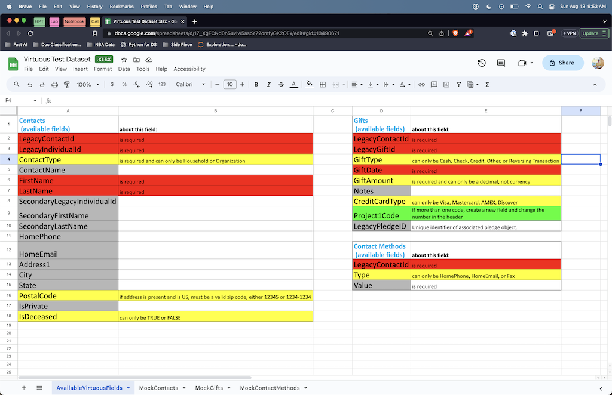

# Virtuous Interview Exam

<!-- WARNING: THIS FILE WAS AUTOGENERATED! DO NOT EDIT! -->

# Requirements

> Virtuous Data Schema, changes that require ETL have been highlighted
> <br>

<br>



## Summary

> I performed ETL of 3 spreadsheets into SQL tables & csv files that
> match the Virtuous schema <br> <br>

- Contacts: A table of contacts, with 1 or 2 constituents per row
- Gifts: Donations from individual constituents
- Contact Methods: Contact information for individual constituents

## Notebooks

> I’ve demonstrated 3 methods of performing the data migraiton <br> <br>

- [Setup](/00_Setup.ipynb)
- Method 1: [SQL](01_SQL_Solution.ipynb)
- Method 2: [Python / Pandas](02_Pandas_Solution.ipynb)
- Method 3: [Generative AI / Chat GPT](03_Gpt_Solution.ipynb)

## Result

> CSV files generated from the Python ETL process <br> <br>

- [final_contacts](data/final_contacts.csv)
- [final_gifts](data/final_gifts.csv)
- [final_contact_methods](data/final_contact_methods.csv) <br> <br> The
  intial datasets are also available in the [data folder](data/)

# Final Results

``` python
import pandas as pd
```

``` python
final_contacts = pd.read_csv('data/final_contacts.csv')
final_contact_methods = pd.read_csv('data/final_contact_methods.csv')
final_gifts = pd.read_csv('data/final_gifts.csv')
```

``` python
final_contacts
```

<div>
<style scoped>
    .dataframe tbody tr th:only-of-type {
        vertical-align: middle;
    }
&#10;    .dataframe tbody tr th {
        vertical-align: top;
    }
&#10;    .dataframe thead th {
        text-align: right;
    }
</style>

|     | LegacyContactId | LegacyIndividualId | ContactName   | FirstName | LastName    | SecondaryLegacyIndividualId | SecondaryFirstName | SecondaryLastName | HomePhone     | HomeEmail                    | Address1              | City         | State | PostalCode | IsPrivate | IsDeceased |
|-----|-----------------|--------------------|---------------|-----------|-------------|-----------------------------|--------------------|-------------------|---------------|------------------------------|-----------------------|--------------|-------|------------|-----------|------------|
| 0   | 653377813-7     | 0                  | NaN           | Karita    | Lumbers     | 1.0                         | Kelvin             | NaN               | NaN           | kklumbers@ yahoo.co          | 4 Bunting Parkway     | Washington   | DC    | NaN        | True      | False      |
| 1   | 390551098-7     | 2                  | NaN           | Helga     | Benech      | NaN                         | NaN                | NaN               | NaN           | ebenech1@goodreads.com       | 48684 Jenifer Way     | Las Vegas    | NV    | 89130.0    | False     | False      |
| 2   | 093004505-X     | 3                  | NaN           | Masha     | NaN         | NaN                         | NaN                | NaN               | 577-374-96523 | NaN                          | 353 Schmedeman Park   | Indianapolis | IN    | NaN        | False     | False      |
| 3   | 729707142-0     | 4                  | A Company Co. | NaN       | NaN         | NaN                         | NaN                | NaN               | NaN           | NaN                          | 2055 Lakewood Parkway | Camden       | NJ    | NaN        | False     | False      |
| 4   | 488464926-5     | 5                  | NaN           | Hoyt      | Castille    | NaN                         | NaN                | NaN               | NaN           | fcastille4@timesonline.co.uk | 37 8th Trail          | Grand Rapids | MI    | 49560.0    | False     | False      |
| 5   | 315297729-8     | 6                  | NaN           | Benedict  | Oscar       | 7.0                         | Idell              | Mouncey           | NaN           | NaN                          | 4225 Madison Ave      | Boise        | ID    | NaN        | False     | False      |
| 6   | 848348568-0     | 8                  | NaN           | Mannie    | Turpin      | NaN                         | NaN                | NaN               | 702-844-9524  | NaN                          | NaN                   | NaN          | NV    | NaN        | False     | True       |
| 7   | 029456846-8     | 9                  | NaN           | NaN       | NaN         | NaN                         | NaN                | NaN               | NaN           | jdoley6@telegraph.co.uk      | 608 Old Shore Alley   | Marietta     | GA    | 30066.0    | False     | False      |
| 8   | 687119652-8     | 10                 | NaN           | Ruggiero  | Makepeace   | NaN                         | NaN                | NaN               | NaN           | cmakepeace7@1688.com         | 15 Sunbrook Center    | Omaha        | NE    | 68164.0    | False     | False      |
| 9   | 739131380-7     | 11                 | NaN           | Rosemaria | Dimond      | 12.0                        | Rogelio            | NaN               | NaN           | NaN                          | NaN                   | Juneau       | AK    | NaN        | False     | False      |
| 10  | 809975531-Y     | 13                 | NaN           | Adeline   | Shakespeare | NaN                         | NaN                | NaN               | NaN           | NaN                          | NaN                   | NaN          | NaN   | NaN        | False     | False      |

</div>

``` python
final_contact_methods
```

<div>
<style scoped>
    .dataframe tbody tr th:only-of-type {
        vertical-align: middle;
    }
&#10;    .dataframe tbody tr th {
        vertical-align: top;
    }
&#10;    .dataframe thead th {
        text-align: right;
    }
</style>

|     | LegacyContactId | Type      | Value                        |
|-----|-----------------|-----------|------------------------------|
| 0   | 093004505-X     | HomePhone | 818-323-9865                 |
| 1   | 653377813-7     | HomePhone | 832-442-4988                 |
| 2   | 848348568-0     | HomePhone | 702-844-9524                 |
| 3   | 029456846-8     | HomeEmail | jdoley6@telegraph.co.uk      |
| 4   | 315297729-8     | HomeEmail | dmouncey9@cnn.com            |
| 5   | 390551098-7     | HomeEmail | ebenech1@goodreads.com       |
| 6   | 488464926-5     | HomeEmail | fcastille4@timesonline.co.uk |
| 7   | 653377813-7     | HomeEmail | kklumbers@ yahoo.co          |
| 8   | 687119652-8     | HomeEmail | cmakepeace7@1688.com         |
| 9   | 093004505-X     | Fax       | 818-156-7985                 |
| 10  | 739131380-7     | Fax       | 626-981-3874                 |

</div>

``` python
final_gifts
```

<div>
<style scoped>
    .dataframe tbody tr th:only-of-type {
        vertical-align: middle;
    }
&#10;    .dataframe tbody tr th {
        vertical-align: top;
    }
&#10;    .dataframe thead th {
        text-align: right;
    }
</style>

|     | LegacyContactId | LegacyGiftId | GiftType              | GiftDate   | GiftAmount | Notes                     | CreditCardType | Project1Code       | Project1Code.1     | LegacyPledgeID |
|-----|-----------------|--------------|-----------------------|------------|------------|---------------------------|----------------|--------------------|--------------------|----------------|
| 0   | 848348568-0     | 95196378     | Other                 | 2019-03-04 | 4.1500     | NaN                       | NaN            | NaN                | NaN                | 0              |
| 1   | 729707142-0     | 95196889     | Check                 | 2019-03-05 | 2.3648     | NaN                       | NaN            | ChildSponsorship   | ChildSponsorship   | 1              |
| 2   | 687119652-8     | 95197689     | Cash                  | 2019-03-07 | 1.3100     | NaN                       | NaN            | NaN                | NaN                | 2              |
| 3   | 653377813-7     | 95198998     | Credit                | 2019-03-10 | 2.0400     | In honor of Mannie Turpin | AMEX           | NaN                | NaN                | 3              |
| 4   | 390551098-7     | 95198999     | Cash                  | 2019-01-10 | 5.8000     | NaN                       | NaN            | NaN                | NaN                | 89752384       |
| 5   | 848348568-0     | 95296677     | Other                 | 2019-03-20 | 9.2800     | NaN                       | NaN            | General            | General            | 5              |
| 6   | 029456846-8     | 95298831     | Check                 | 2019-03-24 | 5.0000     | ACH check \#7687          | NaN            | NaN                | NaN                | 6              |
| 7   | 093004505-X     | 95298845     | Check                 | 2019-04-09 | 4.8300     | NaN                       | NaN            | NaN                | NaN                | 7              |
| 8   | 315297729-8     | 95298997     | Check                 | 2019-04-12 | 7.0000     | NaN                       | NaN            | SchoolSupplies2019 | SchoolSupplies2019 | 8              |
| 9   | 809975531-Y     | 0            | Credit                | 2019-08-14 | 8.4800     | NaN                       | AMEX           | NaN                | NaN                | 9              |
| 10  | 739131380-7     | 95329966     | Credit                | 2019-04-13 | 5.8400     | NaN                       | Visa           | NaN                | NaN                | 10             |
| 11  | 739131380-7     | 95330011     | Other                 | 2019-04-13 | 7.4500     | NaN                       | NaN            | NaN                | NaN                | 11             |
| 12  | 029456846-8     | 95330012     | Check                 | 2019-04-17 | 8.1300     | NaN                       | NaN            | Mentorship2023     | Mentorship2023     | 12             |
| 13  | 315297729-8     | 95330110     | Reversing Transaction | 2019-04-19 | -3.0100    | NaN                       | NaN            | NaN                | NaN                | 13             |
| 14  | 739131380-7     | 95330662     | Other                 | 2019-05-10 | 3.4000     | NaN                       | NaN            | NaN                | NaN                | 14             |
| 15  | 687119652-8     | 95419562     | Other                 | 2019-06-04 | 5.0700     | NaN                       | NaN            | NaN                | NaN                | 15             |
| 16  | 488464926-5     | 95422266     | Cash                  | 2019-06-05 | 5.4200     | NaN                       | NaN            | GeneralFund        | GeneralFund        | 16             |
| 17  | 848348568-0     | 95485564     | Other                 | 2019-06-10 | 6.8000     | NaN                       | NaN            | NaN                | NaN                | 57398862       |
| 18  | 390551098-7     | 95496635     | Other                 | 2019-06-11 | 6.7800     | NaN                       | NaN            | NaN                | NaN                | 18             |
| 19  | 729707142-0     | 95497782     | Other                 | 2019-06-20 | 5.2700     | NaN                       | NaN            | NaN                | NaN                | 19             |
| 20  | 315297729-8     | 0            | Check                 | 2019-06-20 | 5.5900     | NaN                       | NaN            | NaN                | NaN                | 65139856       |
| 21  | 390551098-7     | 95763575     | Credit                | 2019-07-01 | 4.2100     | NaN                       | Mastercard     | NaN                | NaN                | 21             |
| 22  | 488464926-5     | 95798342     | Cash                  | 2019-07-18 | 9.2800     | NaN                       | NaN            | NaN                | NaN                | 22             |
| 23  | 848348568-0     | 95798343     | Other                 | 2019-07-01 | 2.7400     | NaN                       | NaN            | NaN                | NaN                | 23             |
| 24  | 029456846-8     | 95801563     | Other                 | 2019-08-01 | 9.0000     | NaN                       | NaN            | NaN                | NaN                | 24             |
| 25  | 729707142-0     | 95801564     | Cash                  | 2019-08-03 | 1.8800     | NaN                       | NaN            | NaN                | NaN                | 25             |
| 26  | 687119652-8     | 95835492     | Reversing Transaction | 2019-08-12 | -6.7600    | NaN                       | NaN            | NaN                | NaN                | 26             |
| 27  | 809975531-Y     | 0            | Credit                | 2019-08-14 | 7.5800     | NaN                       | Mastercard     | Color run          | Color run          | 27             |
| 28  | 653377813-7     | 0            | Cash                  | 2019-08-26 | 5.4900     | NaN                       | NaN            | NaN                | NaN                | 28             |
| 29  | 739131380-7     | 96638462     | Other                 | 2019-09-01 | 8.9300     | NaN                       | NaN            | ReliefFund         | ReliefFund         | 29             |
| 30  | 093004505-X     | 96638468     | Credit                | 2019-09-06 | 2.6200     | NaN                       | Discover       | NaN                | NaN                | 30             |

</div>
